# Warranty Claim Audit System - Project Plan

## Problem Statement

### Current State

Warranty claims are currently audited using a vector database approach that performs 1:1 similarity matching against historical claims. When a new claim arrives, the system asks: *"Has a very similar claim been submitted before? If so, what was the outcome?"*

While this approach works for straightforward cases, it has significant limitations:

### Key Challenges

1. **Granularity Problem**
   - Claims contain multiple distinct components (symptoms, diagnoses, proposed repairs, labor estimates, parts lists)
   - Current 1:1 matching treats claims as monolithic units
   - A claim with a legitimate symptom but inflated labor estimate gets compared holistically, missing the specific anomaly
   - No ability to independently validate each component against historical norms

2. **Limited Pattern Recognition**
   - Vector similarity only finds "claims that look like this one"
   - Cannot learn complex fraud patterns that span multiple features (e.g., "this combination of vehicle age + repair type + labor hours is suspicious")
   - Struggles with novel fraud schemes that don't closely match historical examples

3. **PII Exposure**
   - Historical claim data contains personally identifiable information (customer names, VINs, dealer info)
   - Current architecture requires PII to flow through the matching pipeline
   - Creates compliance risk and limits ability to use cloud-based or third-party ML services

4. **Training Data Scarcity**
   - Labeled fraud examples are rare and valuable
   - System cannot easily learn from hypothetical or edge-case scenarios
   - No mechanism to systematically generate test cases for known fraud patterns

### Desired Outcome

A hybrid auditing system that:
- Decomposes claims into semantic components and evaluates each independently
- Combines retrieval-based matching with learned ML patterns
- Handles PII appropriately through redaction before processing
- Can be trained on a mix of real historical data and synthetic examples
- Outputs an explainable confidence score with contributing factors

---

## Executive Summary

This document outlines the architecture and implementation plan for a hybrid warranty claim auditing system that combines:
- **Component-level claim decomposition** for granular analysis
- **Vector similarity retrieval** for historical claim matching
- **Supervised ML classification** for pattern-based fraud detection
- **Synthetic + real data training** for robust model performance

---

## 1. High-Level System Architecture

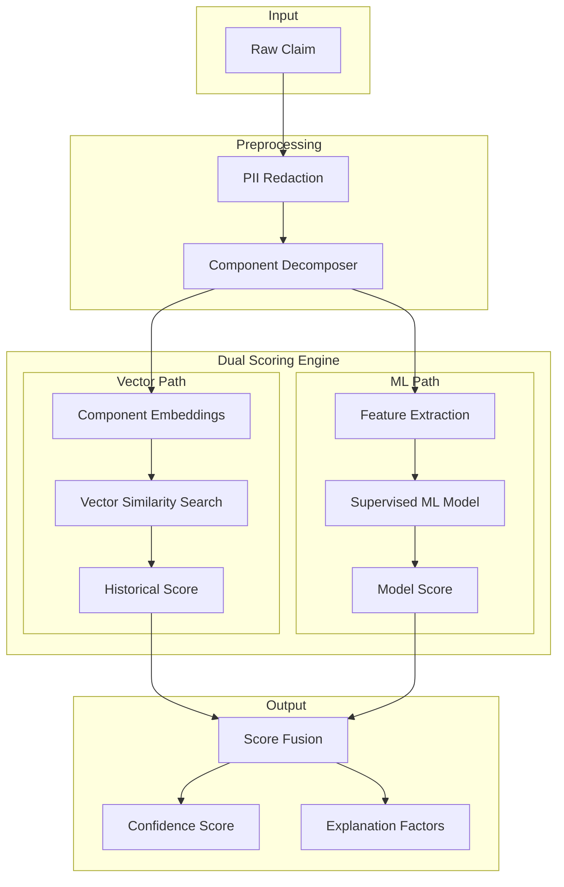

---

## 2. Claim Component Decomposition

### 2.1 Component Categories

| Component | Description | Example |
|-----------|-------------|---------|
| **Symptom** | Customer-reported issue | "Vehicle makes grinding noise when braking" |
| **Diagnosis** | Technician findings | "Brake pads worn to 2mm, rotors scored" |
| **Parts** | Components to replace | "Front brake pads, rotors (pair)" |
| **Labor** | Proposed work hours | "2.5 hours book time" |
| **Vehicle Context** | Make/model/year/mileage | "2019 F-150, 45,000 miles" |
| **Verbatim** | Raw customer language | "It's been squealing for weeks" |

### 2.2 Decomposition Pipeline

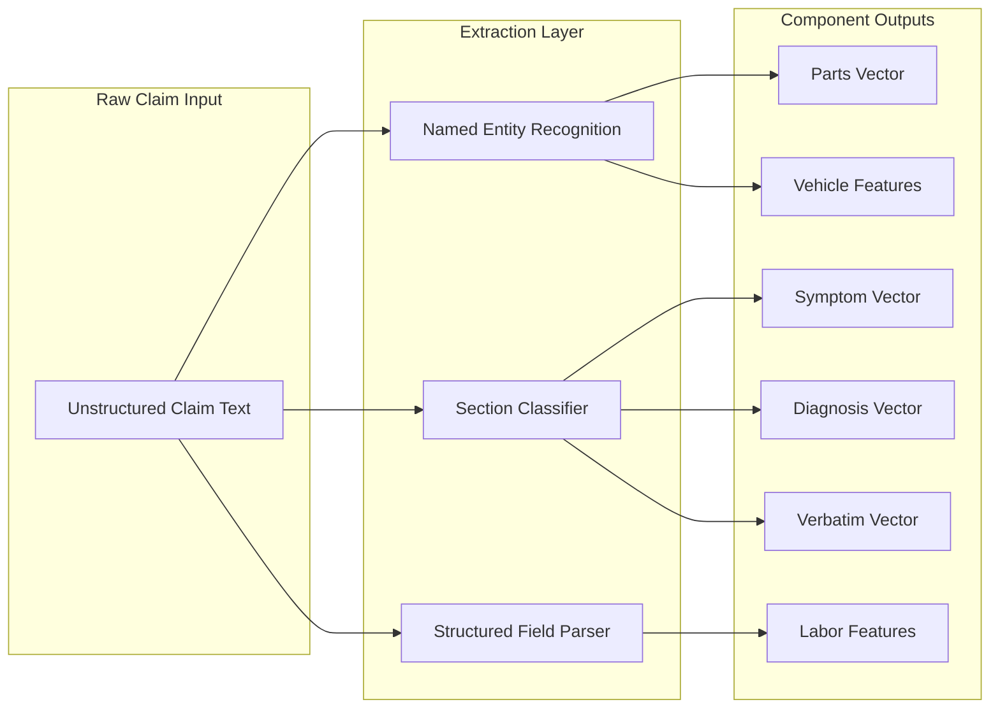

### 2.3 PII Handling in Decomposition

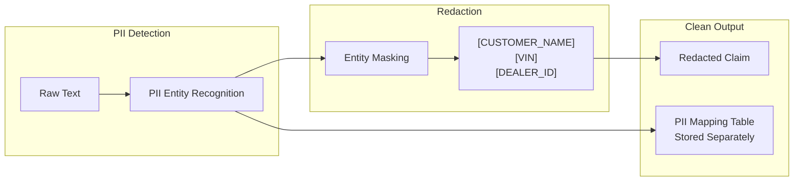

---

## 3. Dual Scoring System

### 3.1 Why Two Paths?

| Vector Similarity Path | Supervised ML Path |
|------------------------|-------------------|
| "Have we seen this exact situation before?" | "Does this match learned fraud patterns?" |
| Explainable via similar claims | Captures complex non-linear relationships |
| No training required | Requires labeled training data |
| Struggles with novel fraud | Generalizes to unseen patterns |

### 3.2 Vector Similarity Scoring Pipeline

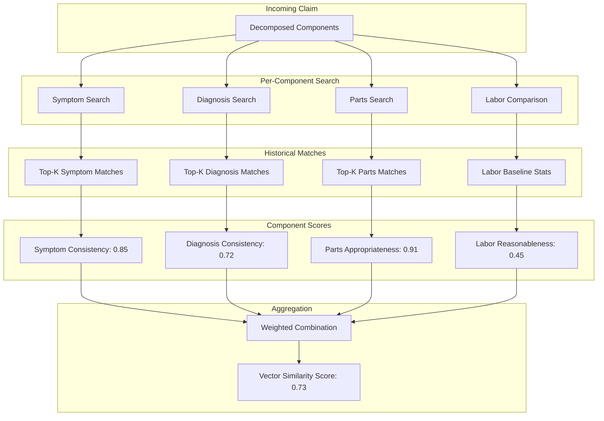

### 3.3 Supervised ML Scoring Pipeline

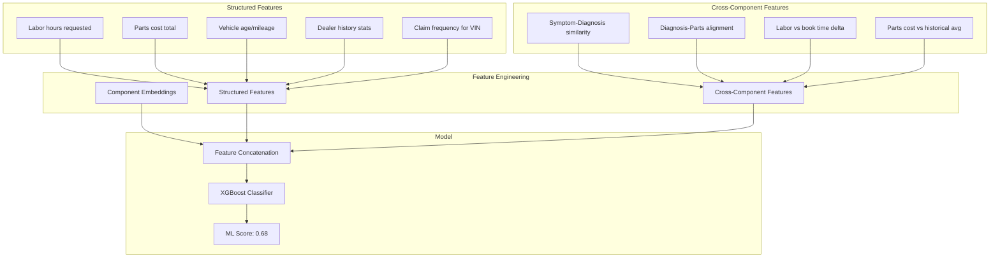

---

## 4. Score Fusion & Final Output

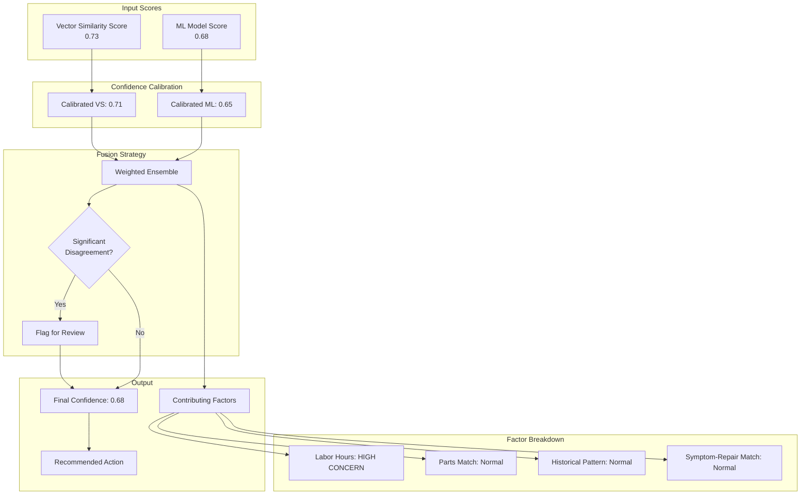

---

## 5. Training Data Strategy

### 5.1 Hybrid Data Pipeline

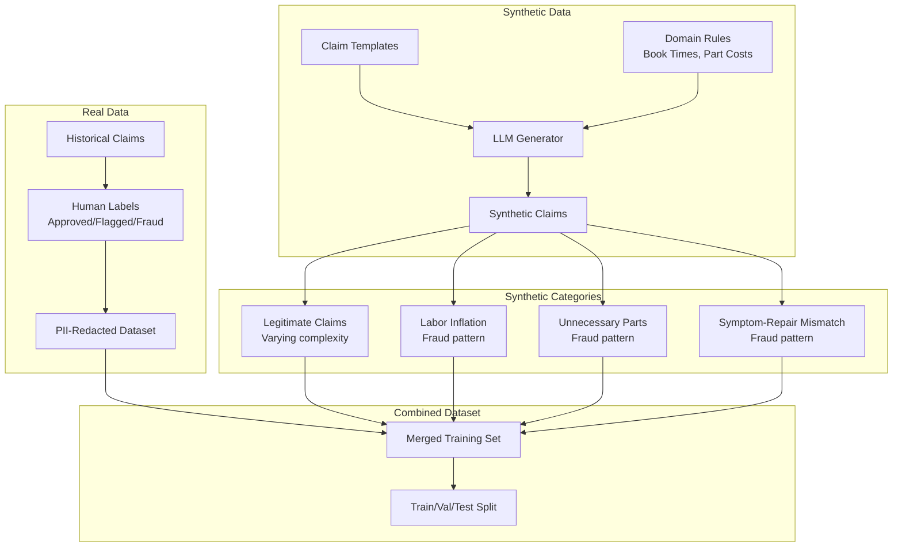

### 5.2 Synthetic Data Generation Detail

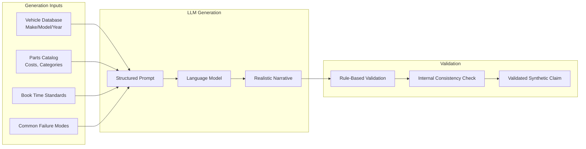

---

## 6. Model Training Pipeline

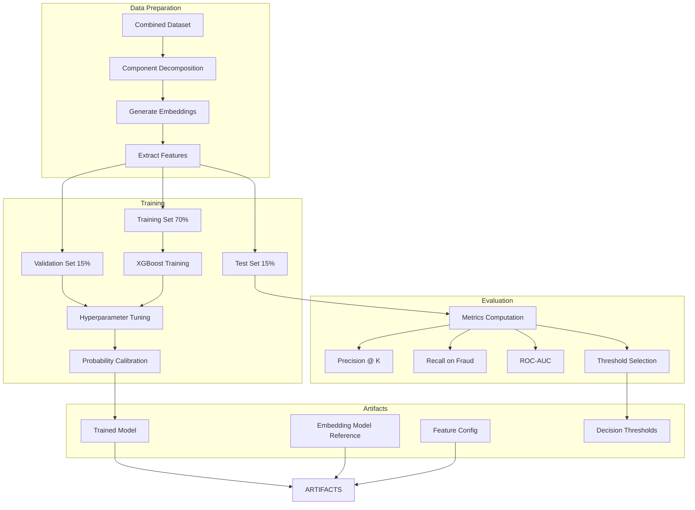

---

## 7. Inference Pipeline (Production)

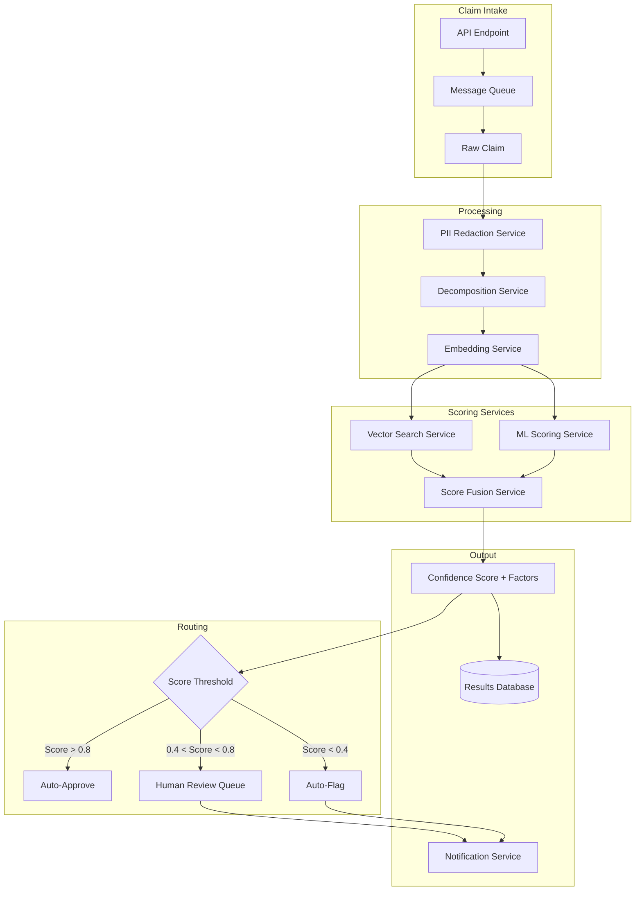

---

## 8. Implementation Phases

### Phase 1: Foundation
- [ ] Set up development environment
- [ ] Implement PII redaction pipeline
- [ ] Build claim component decomposer
- [ ] Select and integrate embedding model

### Phase 2: Vector Similarity System
- [ ] Set up vector database (Pinecone, Weaviate, or Qdrant)
- [ ] Implement per-component embedding and indexing
- [ ] Build similarity search and scoring logic
- [ ] Create baseline evaluation metrics

### Phase 3: Synthetic Data Generation
- [ ] Define claim templates and variation parameters
- [ ] Build LLM-based claim generator
- [ ] Implement rule-based validation
- [ ] Generate initial training dataset (legitimate + fraud patterns)

### Phase 4: Supervised ML Model
- [ ] Feature engineering pipeline
- [ ] Model training and hyperparameter tuning
- [ ] Probability calibration
- [ ] Evaluation on held-out test set

### Phase 5: Score Fusion & Integration
- [ ] Implement score fusion logic
- [ ] Build explanation/factor extraction
- [ ] Create API endpoints
- [ ] Set up routing thresholds

### Phase 6: API & Web UI
- [ ] Build REST API with FastAPI exposing `/score` endpoint (accepts claim text, returns detailed confidence scores and contributing factors)
- [ ] Add `/health` and `/status` endpoints for service monitoring
- [ ] Build simple web UI (single-page) with:
  - [ ] Text input area for pasting/typing raw claim text
  - [ ] Submit button to send claim for scoring
  - [ ] Results panel showing overall confidence score, per-component scores (symptom, diagnosis, parts, labor), contributing factor breakdown, and recommended action (auto-approve / review / flag)
  - [ ] History sidebar showing previous submissions in the current session
- [ ] Containerize the web UI (lightweight Nginx + static assets or Node server)
- [ ] Wire web UI to API via OpenAPI-generated client

### Phase 7: Production Hardening
- [ ] Performance optimization
- [ ] Monitoring and alerting
- [ ] A/B testing framework
- [ ] Feedback loop for model retraining

---

## 9. Technology Stack Recommendations

| Component | Recommended Tools |
|-----------|------------------|
| **Embedding Model** | `sentence-transformers/all-MiniLM-L6-v2` or `BAAI/bge-small-en` |
| **Vector Database** | Qdrant (self-hosted) or Pinecone (managed) |
| **ML Framework** | XGBoost + scikit-learn |
| **Synthetic Generation** | Claude API or GPT-4 with structured prompts |
| **PII Detection** | Presidio (Microsoft) or spaCy NER |
| **Orchestration** | FastAPI + Celery or AWS Step Functions |
| **Feature Store** | Feast or custom Postgres-based |
| **Web UI** | React (Vite) or plain HTML/JS with Tailwind CSS |
| **API Documentation** | FastAPI auto-generated OpenAPI/Swagger UI |
| **Containerization** | Docker Compose (API + Qdrant + Embedding Service + Web UI) |

---

## 10. Success Metrics

| Metric | Target | Rationale |
|--------|--------|-----------|
| **Precision @ Human Review** | > 70% | Flagged claims should be worth reviewing |
| **Recall on Known Fraud** | > 90% | Catch most fraudulent claims |
| **Auto-Approve Rate** | > 60% | Reduce human workload |
| **False Flag Rate** | < 5% | Minimize dealer friction |
| **Processing Latency** | < 2 sec | Real-time scoring |

---

## Appendix: Sample Claim Flow

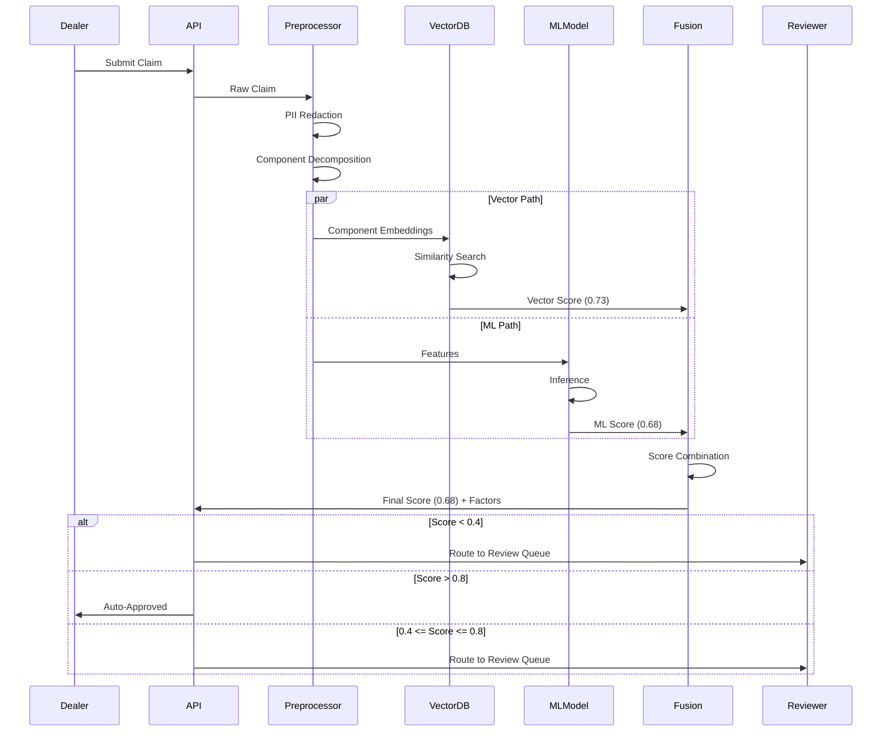
